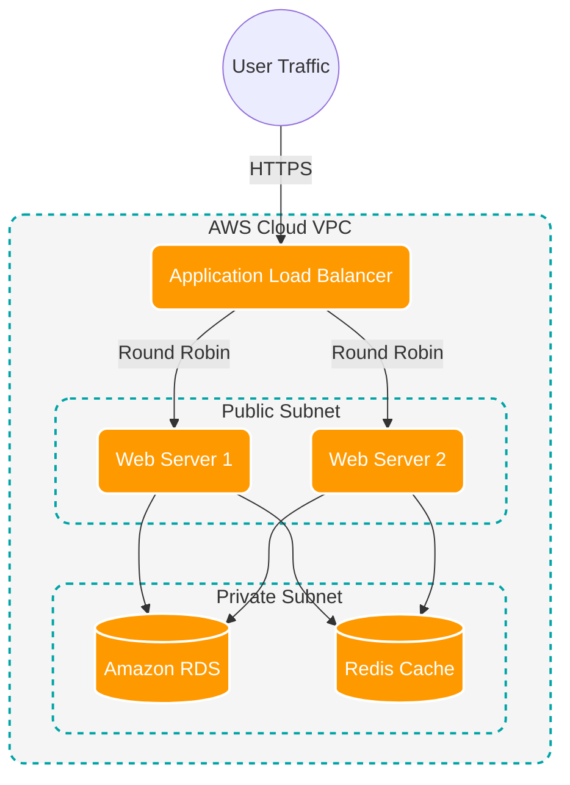

# How to Draw AWS Architecture Diagrams with OpenFlowKit

Drawing cloud infrastructure can be tedious if you are dragging and dropping shapes manually. OpenFlowKit provides a **Diagram-as-Code** approach to visualizing AWS Architectures, making it perfect for DevOps teams, Solutions Architects, and Cloud Engineers.

## Why Use Diagram-as-Code for AWS?

Instead of spending hours aligning server icons, you can write simple text that OpenFlowKit instantly renders into a beautiful, auto-routed diagram. Because it's code, your architecture diagram can live right next to your Terraform or CloudFormation scripts in Git.

- **Version Control**: Track infrastructure changes over time.
- **Auto-Layout**: No more overlapping lines or misaligned VPCs.
- **Speed**: Type a few lines, get a complete diagram.

## Example: Basic Web Architecture (Mermaid.js)

OpenFlowKit natively supports Mermaid.js, which is great for standard cloud structures. Here is how you can visualize an AWS VPC with a Load Balancer, EC2 instances, and an RDS database.

## Creating AWS Diagrams with AI

If you don't know Mermaid syntax, you can use **Flowpilot**, our built-in AI assistant. 

1. Open the [Command Center](/docs/en/command-center).
2. Type a prompt like:
> `"Create an AWS architecture diagram showing an API Gateway routing traffic to three AWS Lambda functions, which all connect to a central DynamoDB table."`
3. Hit enter. Flowpilot will instantly generate the DSL and render the diagram.

## Exporting for internal documentation

Once your AWS Architecture is generated, you can easily export it:
- **SVG / PNG**: For Confluence, Jira, or Slack.
- **Figma Editable**: Want your UX team to polish the diagram? Click *Figma Editable* and paste it directly into Figma as native, editable vector layers.

[Try building your first AWS Architecture diagram now!](/#/canvas)
