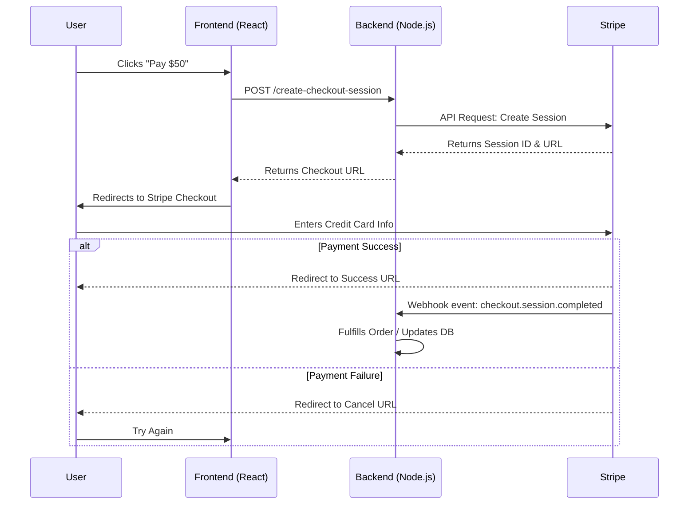

# How to Visualize Payment Flows (Stripe, PayPal, etc.)

When building e-commerce or SaaS applications, understanding the exact sequence of a payment flow is critical. A single missed webhook can lead to a dropped order or an angry customer.

OpenFlowKit allows you to map out complex asynchronous payment architectures quickly using a variety of [Node Types](/docs/en/node-types).

## Why build payment architectures with OpenFlowKit?

- **Shareability**: Everyone from the PM to the backend engineer needs to see the same flow.
- **Clarity**: Mapping out happy paths, failures, and webhook retries visually is much easier than reading through Stripe API documentation.
- **Speed**: Use the [Command Center](/docs/en/command-center) and AI to generate the boilerplate flow in seconds.

## Example: Stripe Checkout Flow

Here is a common Stripe Checkout implementation mapped out. Notice how we use different node shapes to distinguish between client-side actions, server-side actions, and third-party API calls.

## Tips for Better Payment Diagrams

1. **Use Swimlanes**: Group actions by responsibility. Put the User in one lane, your API in another, and the Payment Processor (Stripe/PayPal) in a third.
2. **Color Code**: Use green for happy paths (success), red for failure states (declines/insufficient funds), and gray for retries.
3. **Explicit Callouts**: Use the **Annotation Node** to document exact webhook payloads or secret keys needed at specific steps.

## AI Prompt Example

To generate a similar flow using [Ask Flowpilot](/docs/en/ask-flowpilot):

> `"Generate a flowchart showing a subscription payment flow using Braintree. Include the client requesting a client token, the server generating it, the user submitting a nonce, and the final server-side transaction creation. Show both success and failure branches."`

Need to present this to your team? Try the [Playback History](/docs/en/playback-history) feature to walk through the payment sequence step-by-step.
