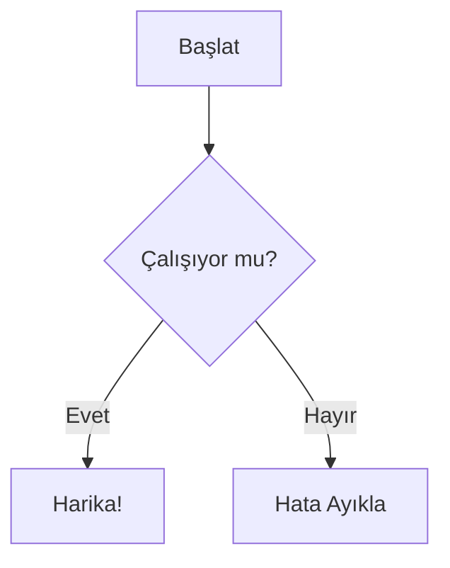

FlowMind, kod olarak diyagram için endüstri standardı olan [Mermaid.js](https://mermaid.js.org/) ile yüksek uyumluluk sağlar.

## Mermaid İçe Aktarma

Mevcut Mermaid kodunu doğrudan FlowMind'a yapıştırabilirsiniz.

1.  Araç çubuğundaki **"İçe Aktar"** düğmesine tıklayın.
2.  **"Mermaid"** seçeneğini seçin.
3.  Kod parçacığınızı yapıştırın.

### Desteklenen Diyagram Türleri
FlowMind şu an için aşağıdakileri optimize etmektedir:
*   **Akış Şemaları** (`graph TD`, `graph LR`)
*   **Sekans Diyagramları** (Dönüşüm yoluyla kısmi destek)

## Mermaid'e Dışa Aktarma

Herhangi bir FlowMind diyagramını Mermaid sözdizimine *geri* aktarabilirsiniz.
Bu özellik, GitHub `README.md` dosyalarına veya Notion belgelerine diyagram gömmek için idealdir.

1.  **Kod Paneli**'ni açın (alt panel).
2.  **"Mermaid"** sekmesine geçin.
3.  Oluşturulan kodu kopyalayın.
